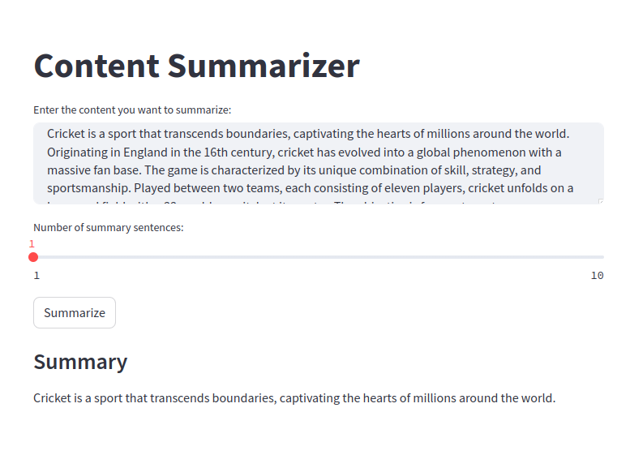

The Content Summarizer application is a web-based tool created using Streamlit that provides users the ability to automatically summarize long pieces of text. It utilizes a BERT-based summarization model from the 'summarizer' package, ensuring high-quality summaries that capture the essence of the original text.

Users can interact with the application by entering their text into a designated area and then adjusting a slider to select how many sentences they want their summary to contain, ranging from 1 to 10 sentences. This allows users to customize the summary length according to their needs.

Once the user has input their text and set their preferred summary length, they can generate the summary by clicking the 'Summarize' button. The summarized content is then displayed under a subheader for easy reading. In case no text is entered, the application provides a warning message to guide the user to provide content before summarizing.

This tool is especially useful for those who need to quickly distill information from lengthy documents, saving time and effort while retaining the critical points of the text.

https://huggingface.co/spaces/razaAhmed/ContentSummarizer